## Train
    python train.py --config data_configs/fishes.yaml --epochs 70 --batch-size 10 --results-folder fishes --use-train-aug --no-mosaic

### Training Plots
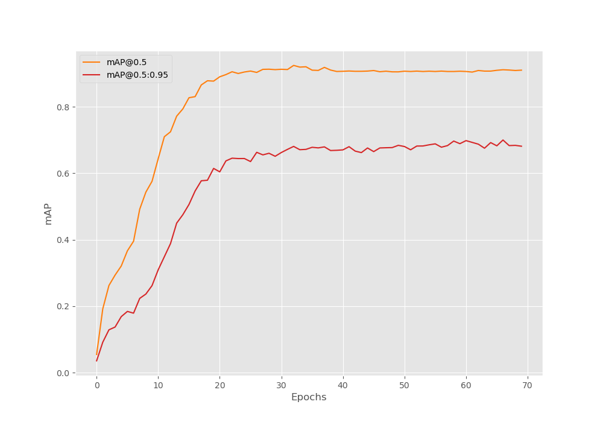
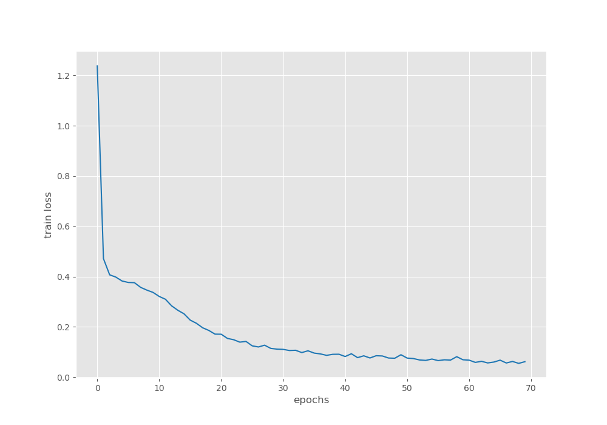
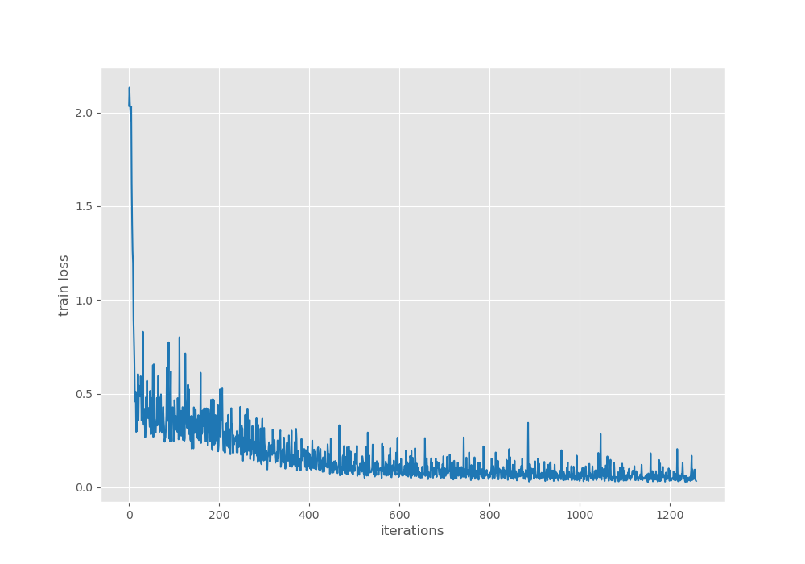
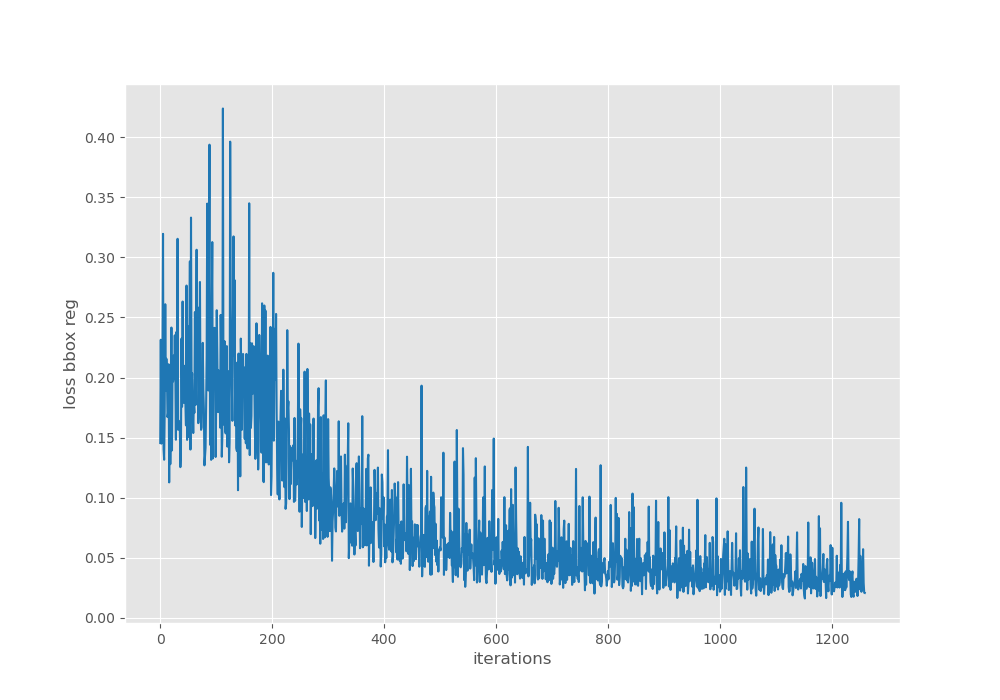
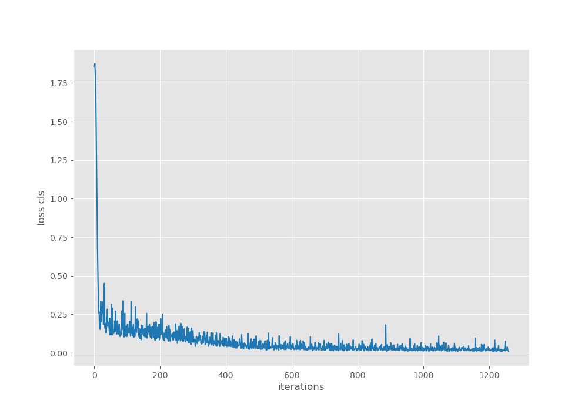
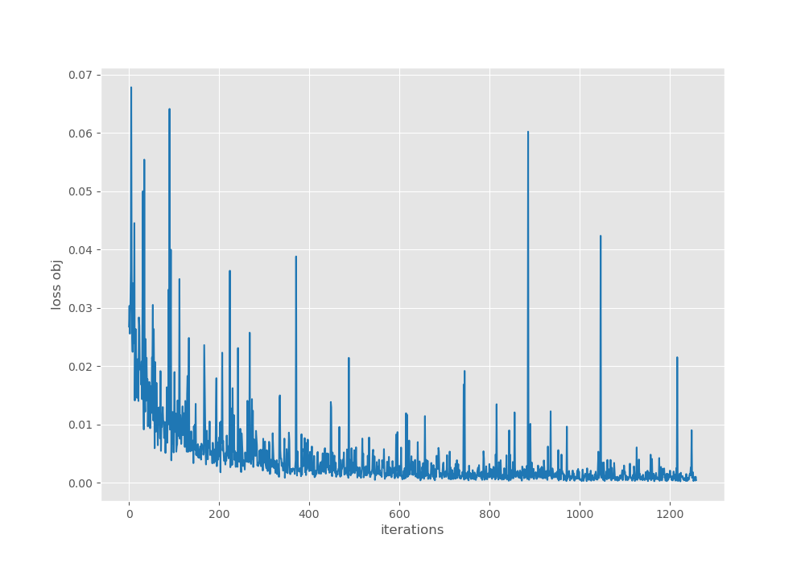
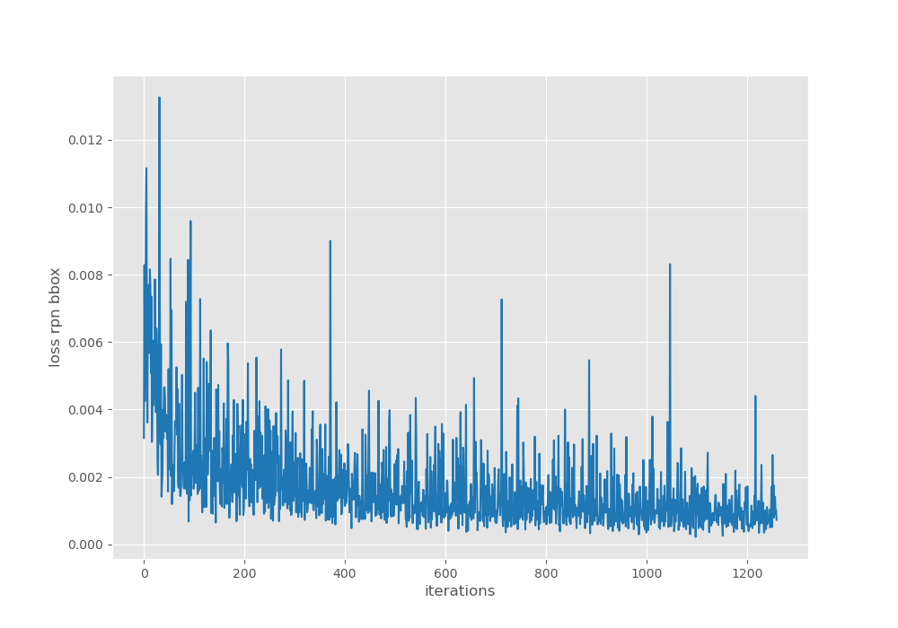

## Inference
    ​python inference.py --weights runs/train/fishes/best_model.pth --input D:/CV/datasets/fishes_voc/test

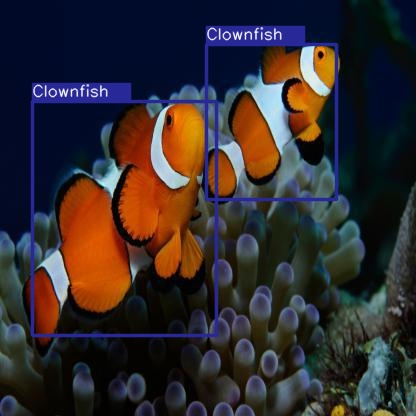
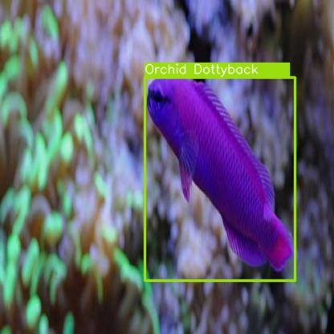

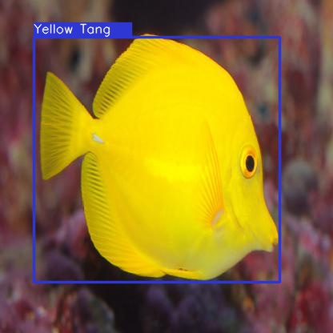
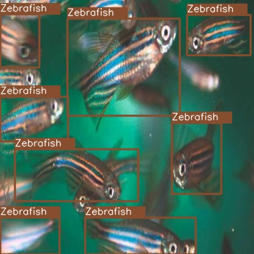